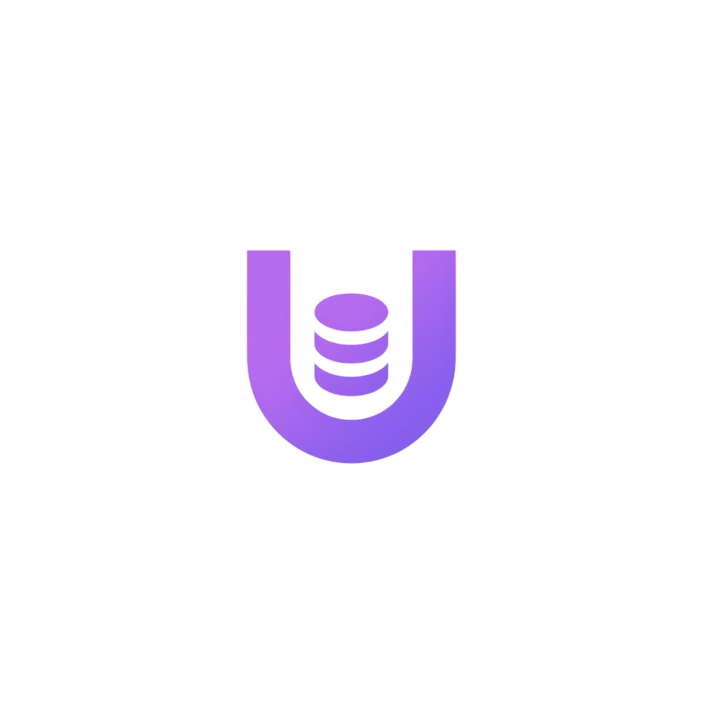

#  UniBase

UniBase provides a unified, premium web-based interface to connect to and interact with multiple database systems, including PostgreSQL, Microsoft SQL Server, MySQL, MongoDB.

## 🚀 Key Features

- **Multi-Database Support**: Connect to and manage multiple different database systems from a single, unified application.
- **Modern Design System**: A consistent violet/purple design system with professional aesthetics, dark mode support, and smooth transitions.
- **Enhanced Query Editor**: Write and execute queries using an integrated Monaco-based editor with syntax highlighting and intelligent formatting.
- **Interactive Metadata Explorer**: Deep-dive into your database structure with a dynamic tree view for tables, collections, and schemas, powered by Font Awesome icons.
- **Advanced MongoDB Support**: Specialized MongoDB explorer with field-based autocomplete, simplified query syntax, and optimized pagination for high-performance data browsing.
- **Connection Management**: Securely add, test, save, and manage multiple database connections with a streamlined interface.

---

## 🏁 Getting Started

### Prerequisites

Ensure you have the following installed on your machine:

- **Node.js**: v18.x or higher
- **Go**: v1.21.x or higher
- **Angular CLI**: v20.3.x (`npm install -g @angular/cli@20.3.10`)

### Installation & Running

1. **Clone the Repository**

   ```bash
   git clone https://github.com/dev-mahmoudhamed/UniBase.git
   cd UniBase
   ```

2. **Launch the Application**

   The quickest way to start UniBase is to use the provided launch scripts. These scripts will automatically build the frontend into static files and then serve the entire application from the Go backend.

   **On Windows:**
   Open a PowerShell terminal and run:

   ```powershell
   ./run.ps1
   ```

   **On macOS/Linux:**
   Open a terminal and run:

   ```bash
   ./run.sh
   ```

   Once the application is running, open your web browser and navigate to `http://localhost:5000` to start adding database connections.

---

## ℹ️ Important Details

- **Architecture**: The application uses a high-performance Go backend to manage database drivers and connections securely, serving an Angular-based frontend for a responsive and intuitive user experience.
- **Visual Identity**: Integrated Font Awesome and PrimeNG for a modern, accessible UI that adheres to the unified violet design system, ensuring a premium feel across all platforms.

---

## 📄 License

This project is licensed under the MIT License.
